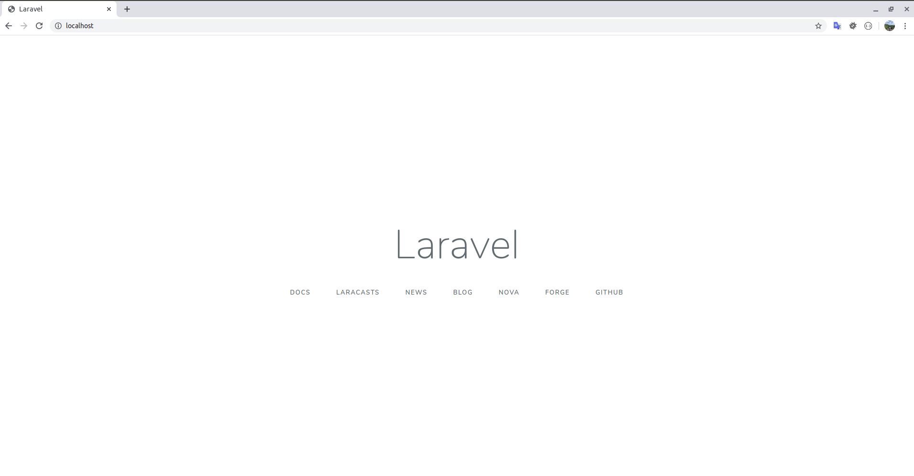
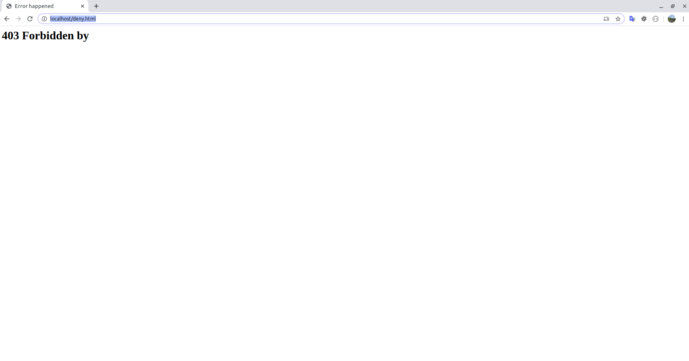

# Swoole Nginx Laravel

 Easy Swoole with Nginx Mod Security Proxy Reverse for Laravel in Docker.
 
### Requirements

- [Docker](https://docs.docker.com/)
- [Docker Compose](https://docs.docker.com/compose/)

### Libraries

- [Modsecurity](https://modsecurity.org/crs)
- [Nginx](http://nginx.org/)
- [Swoole](https://www.swoole.co.uk/)
- [Laravel](https://laravel.com/)
- [Laravel Swoole](https://github.com/swooletw/laravel-swoole)
- [Redis](https://redis.io/)
- [Maria DB](https://mariadb.org/)

### Install

    cp .env.example .env
    docker-compose -f docker-compose.yml up --build -d --scale app=1
    
### Run Application

- [http://localhost/](http://localhost/)



### Check Mod Security

 - [http://localhost/?exec=/bin/bash](http://localhost/?exec=/bin/bash)



### AB Test

    docker run --network swoole --rm jordi/ab -k -c 100 -n 1000 http://web/
 
```
This is ApacheBench, Version 2.3 <$Revision: 1826891 $>
Copyright 1996 Adam Twiss, Zeus Technology Ltd, http://www.zeustech.net/
Licensed to The Apache Software Foundation, http://www.apache.org/

Benchmarking web (be patient)
Completed 100 requests
Completed 200 requests
Completed 300 requests
Completed 400 requests
Completed 500 requests
Completed 600 requests
Completed 700 requests
Completed 800 requests
Completed 900 requests
Completed 1000 requests
Finished 1000 requests


Server Software:        nginx
Server Hostname:        web
Server Port:            80

Document Path:          /
Document Length:        2360 bytes

Concurrency Level:      100
Time taken for tests:   25.325 seconds
Complete requests:      1000
Failed requests:        0
Keep-Alive requests:    1000
Total transferred:      3203876 bytes
HTML transferred:       2360000 bytes
Requests per second:    39.49 [#/sec] (mean)
Time per request:       2532.476 [ms] (mean)
Time per request:       25.325 [ms] (mean, across all concurrent requests)
Transfer rate:          123.55 [Kbytes/sec] received

Connection Times (ms)
              min  mean[+/-sd] median   max
Connect:        0    0   1.0      0       5
Processing:   116 2291 1228.5   2296    7641
Waiting:      112 2291 1228.5   2296    7641
Total:        116 2292 1228.4   2300    7641

Percentage of the requests served within a certain time (ms)
  50%   2300
  66%   3022
  75%   3361
  80%   3414
  90%   3834
  95%   4144
  98%   4207
  99%   5837
 100%   7641 (longest request)
```
